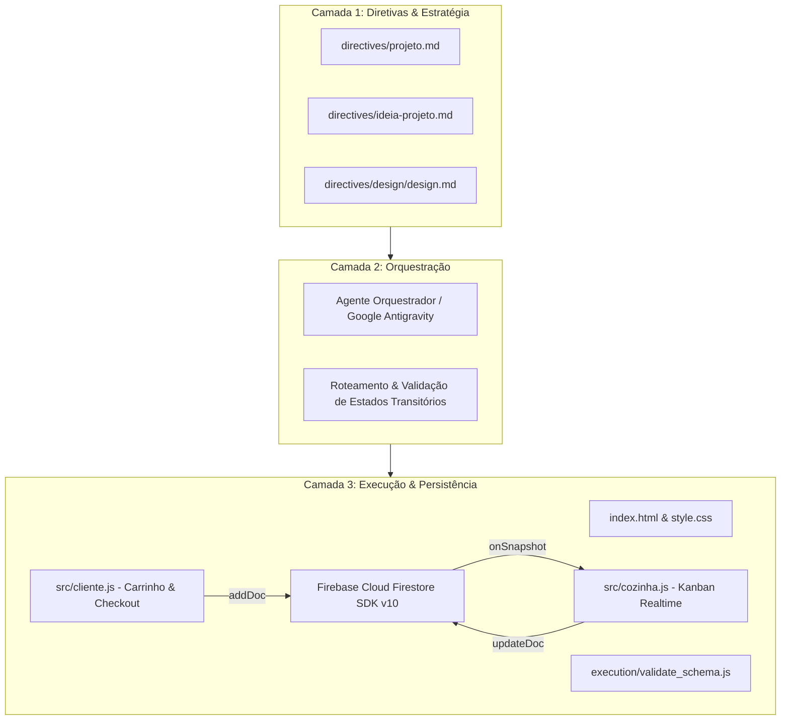

# 🏛️ Documentação de Arquitetura - BurguerSync Ourinhos

## 1. Visão Geral da Arquitetura de 3 Camadas

O sistema **BurguerSync Ourinhos** é implementado seguindo o padrão arquitetural de 3 Camadas do Google Antigravity:



---

## 2. Fluxo de Dados e Ciclo de Vida do Pedido

1. **Jornada do Cliente:**
   - O cliente navega pelos lanches artesanais na vitrine.
   - Adiciona produtos ao carrinho e inclui observações personalizadas (ex: "Sem cebola").
   - O sistema calcula o subtotal e soma a taxa de entrega fixa de Ourinhos (**R$ 5,00**).
   - O formulário valida os dados cadastrais (exigência de celular no **DDD 14**).
   - Ao finalizar, o pedido é salvo na coleção `pedidos` com o status inicial `"Recebido"`.

2. **Jornada da Cozinha:**
   - O monitor da cozinha mantém uma escuta reativa em tempo real com `onSnapshot`.
   - Novos pedidos acionam um sinal sonoro (buzzer) e renderizam o card correspondente com destaque nas observações.
   - O chapeiro/cozinheiro avança o ciclo operacional:
     - `Recebido` (Ciano Neon)
     - `Em Preparo` (Amarelo Neon)
     - `Saiu para Entrega` (Laranja Neon)
     - `Entregue` (Verde Neon)

---

## 3. Modelo de Dados do Firestore (Coleção `pedidos`)

```json
{
  "cliente": {
    "nome": "string",
    "email": "string",
    "celular": "string (DDD 14)",
    "endereco": "string",
    "obsEntrega": "string"
  },
  "itens": [
    {
      "nome": "string",
      "preco": 28.00,
      "quantidade": 1,
      "obsItem": "string"
    }
  ],
  "pagamento": {
    "metodo": "Pix | Cartao_Entrega | Dinheiro_Entrega",
    "troco": "string"
  },
  "valores": {
    "subtotal": 28.00,
    "taxaEntrega": 5.00,
    "total": 33.00
  },
  "status": "Recebido | Em Preparo | Saiu para Entrega | Entregue",
  "horario": "serverTimestamp()"
}
```

---

## 4. Rodapé Oficial
Todo o frontend inclui de forma padronizada na última linha centralizado:
`Criado por siteprofissional.pro` (com link direto em azul para `https://siteprofissional.pro`).
