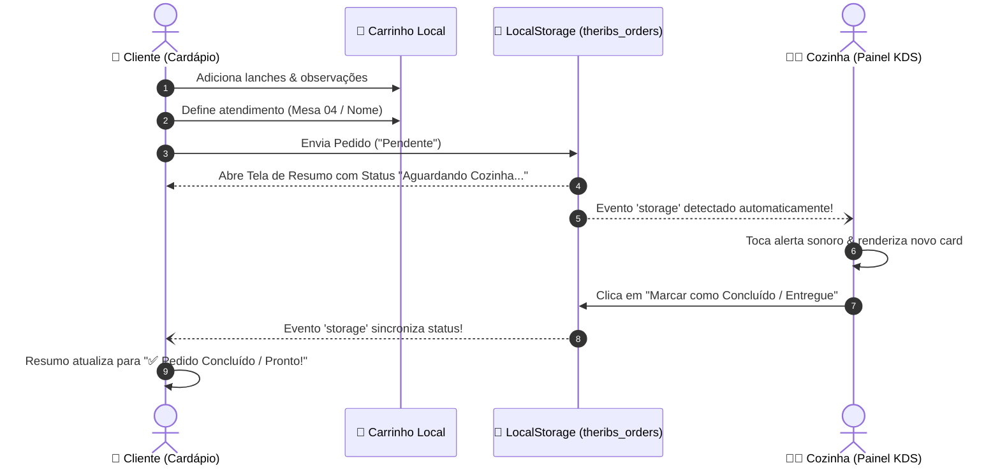

# 📐 Arquitetura & Fluxo de Dados - The Ribs Hamburgueria

Documentação técnica do fluxo de pedidos, sincronização de estado entre cliente e cozinha e ciclo de vida do pedido.

---

## 🔄 Fluxo de Pedido e Sincronização

---

## 🛠️ Componentes e Telas

1. **Portal Central (`index.html` na raiz):**
   - Roteia o usuário para o Cardápio do Cliente ou para o Painel da Cozinha.

2. **Cardápio Online do Cliente (`/frontend/cliente/index.html`):**
   - Catálogo categorizado com 22 produtos.
   - Modal com zoom interativo 2x na foto do lanche.
   - Campo para observações personalizadas por item.
   - Gaveta lateral (Drawer) do carrinho com contador e ajuste de quantidades.
   - Formulário para atendimento no local (Mesa) ou entrega/retirada.
   - Tela de resumo com status dinâmico sincronizado em tempo real.
   - Opção para enviar o comprovante no WhatsApp.

3. **Painel KDS da Cozinha (`/frontend/admin/index.html`):**
   - Monitoramento contínuo da chave `theribs_orders`.
   - Cards com destaque para observações dos clientes.
   - Botão de ação única: "Marcar como Concluído / Entregue".
   - Botão para reabrir pedido se necessário.
   - Filtros por status e estatísticas em tempo real.
   - Alerta sonoro via Web Audio API.
