# 📊 Arquitetura do Funil de Decisão - Chatbot SENAI Ourinhos

Documento técnico descritivo da estrutura do funil e árvore de decisão por botões.

---

## 🎯 Visão Geral do Fluxo (Funnel Architecture)

O chatbot opera 100% orientado a seleção de opções por botões (sem campo de digitação livre), eliminando atritos e conduzindo o usuário diretamente à tomada de decisão ou contato com a secretaria.

```mermaid
graph TD
    A[Início / Menu Principal] --> B[Catálogo Completo de Cursos]
    A --> C[Horários de Atendimento]
    A --> D[Localização e Contato]
    A --> E[Redes Sociais Oficiais]

    B --> F1[1. TI & Inteligência Artificial]
    B --> F2[2. Robótica & Automação Industrial]
    B --> F3[3. Eletroeletrônica & Energia Solar]
    B --> F4[4. Mecânica de Precisão & Usinagem CNC]
    B --> F5[5. Gestão da Produção & Logística 4.0]

    F1 --> C1[Desenvolvimento Web Full Stack]
    F1 --> C2[IA Generativa & Prompts]
    F1 --> C3[Cibersegurança & Defesa Digital]
    F1 --> C4[Ciência de Dados & Python]

    F2 --> C5[Robótica Industrial & Células]
    F2 --> C6[Automação com CLP e Sensores]
    F2 --> C7[Internet das Coisas Industrial IIoT]

    F3 --> C8[Eletricista Instalador]
    F3 --> C9[Energia Solar Fotovoltaica]
    F3 --> C10[Comandos Elétricos]

    F4 --> C11[Torno e Fresa CNC]
    F4 --> C12[Mecânico de Manutenção]
    F4 --> C13[Modelagem 3D & SolidWorks]

    F5 --> C14[Lean Manufacturing & Produção]
    F5 --> C15[Logística Integrada & Supply Chain]
    F5 --> C16[Segurança do Trabalho & NRs]

    C1 & C2 & C3 & C4 & C5 & C6 & C7 & C8 & C9 & C10 & C11 & C12 & C13 & C14 & C15 & C16 --> W[📲 Conversão Direta: WhatsApp Oficial]
```

---

## 🏆 As 5 Grandes Áreas Industriais & Cursos Enriquecidos

| Área | Cursos Inclusos | Destaque Técnico |
| :--- | :--- | :--- |
| **1. TI & Inteligência Artificial** | Full Stack, IA Generativa, Cibersegurança, Ciência de Dados | Frontend/Backend, LLMs, LGPD, Python & Power BI |
| **2. Robótica & Automação** | Robótica Industrial, CLP Siemens/Rockwell, IIoT | Manipuladores KUKA/ABB, Lógica Ladder, MQTT |
| **3. Eletroeletrônica & Solar** | Eletricista Instalador, Energia Solar, Comandos Elétricos | NR10, Módulos Fotovoltaicos, Inversores |
| **4. Mecânica & CNC** | Torno e Fresa CNC, Manutenção de Máquinas, CAD/SolidWorks | Código ISO/G, Hidráulica/Pneumática, Modelagem 3D |
| **5. Gestão & Logística 4.0** | Lean Manufacturing, Supply Chain, Segurança do Trabalho | Kaizen, 5S, WMS, NR12 e NR35 |

---

## 🔗 Pontos de Contato Oficiais
- **Unidade:** Escola SENAI Ourinhos - SP
- **Telefone:** (14) 3302-1250
- **WhatsApp Integrado:** +55 (14) 3302-1250 com mensagens dinâmicas por curso.
