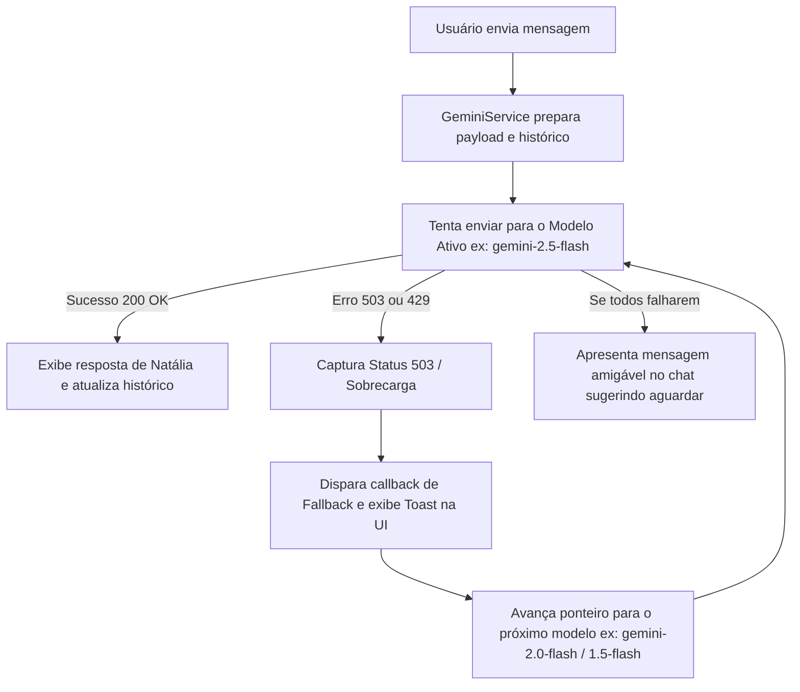

# 🏛️ Documentação de Arquitetura - Chatbot de Relacionamento (Natália)

## 📌 Visão Geral do Sistema

O projeto **Chatbot Natália** foi concebido como uma aplicação conversacional de alto nível estético e funcional, unindo computação client-side moderna (HTML5, CSS3, JavaScript ES6+) com a API Generativa do **Google AI Studio (Gemini v1beta)**.

---

## 🏗️ Estrutura de Pastas e Componentes

Conforme as diretrizes arquiteturais do **Google Antigravity** e o perfil de instrução SENAI, a organização do projeto segue a divisão clara de responsabilidades:

```text
0210-chatbot-relacionamento/
├── .agents/                 # Configurações, regras e agentes Antigravity
├── .env                     # Variável de ambiente (gemini_api_key=) na raiz
├── backend/                 # Servidor opcional Node.js/Express
│   ├── .env                 # Variáveis de ambiente locais do backend
│   ├── package.json         # Dependências do servidor (express, cors, dotenv)
│   └── server.js            # Servidor para servir arquivos e carregar .env
├── frontend/                # Interface visual e lógica cliente
│   ├── assets/              # Mídias locais e avatares da Natália
│   ├── css/                 # Folhas de estilo modernas e responsivas
│   │   └── style.css        # Design System (Luxury Dark, Champagne Gold)
│   ├── js/                  # Módulos de script JavaScript
│   │   ├── config.js        # Configuração da chave de API e System Instruction
│   │   ├── gemini.js        # Serviço de comunicação com a API Gemini e fallback 503
│   │   └── app.js           # Gerenciador de eventos, UI e histórico
│   └── index.html           # Ponto de entrada da interface web
├── documentation/           # Documentação técnica e histórico
│   ├── promptHistory.md     # Rastreabilidade de prompts da sessão
│   ├── arquitetura.md       # Este documento
│   └── persona_natalia.md   # Engenharia de Prompt e personalidade da modelo
└── README.md                # Apresentação do projeto bilíngue
```

---

## ⚡ Fluxo de Tratamento de Erro 503 e Fallback Automático

Um dos requisitos cruciais deste projeto é a resiliência contra indisponibilidades de modelos gratuitos (especialmente o código HTTP `503 Service Unavailable / Model Overloaded`):



### Ordem de Prioridade dos Modelos:
1. `gemini-2.5-flash` (Alta velocidade, raciocínio aprimorado)
2. `gemini-2.0-flash` (Excelente taxa de resposta)
3. `gemini-1.5-flash` (Modelo leve e de grande contexto)
4. `gemini-1.5-pro` (Modelo de alta precisão)
5. `gemini-1.0-pro` (Fallback legado de máxima compatibilidade)

---

## 🔑 Formas Flexíveis de Configuração da Chave da API

O usuário possui três alternativas simples para inserir sua chave:
1. **Pelo arquivo `.env`**: Na raiz ou em `/backend/.env` definindo `gemini_api_key=SUA_CHAVE`.
2. **Direto no Código**: No arquivo `frontend/js/config.js` na propriedade `GEMINI_API_KEY: "SUA_CHAVE"`.
3. **Pela Interface Web**: No modal de configurações (ícone ⚙️) no cabeçalho do chat, gravando com segurança no `localStorage` do navegador.

---

## 📱 Responsividade e Compatibilidade
- **Mobile First**: Totalmente otimizado para telas verticais de smartphones com teclado virtual e `viewport` configurado.
- **Desktop**: Layout centralizado estilo mensageiro de luxo, preservando proporções ergonômicas de leitura.
